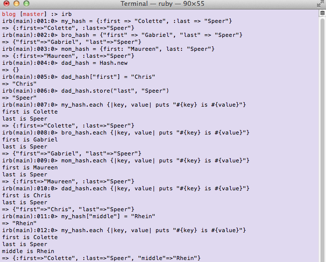

Hello all! Today, we are talking about Arrays and Hashes These two elements are very similar to each other as they are both collections of things. How they differ is by what they collect and by how they are indexed.

Let's start with Arrays. Arrays are an ordered collection that are index with integers.
Let's take, for example, an array called `my_array`. As is the convention with computer related lists, the first index is [0]. In order to access any item in the array, you call the array at the index 1 less than the number in the list that it is. I know that was very wordy so here's an example. Let's say `my_array` is full of the integers: `[22, 16, 7, 8, 11]`. If we wanted to figure out what was in a certain index this is what we would write: `my_array[1]`. This will return what is in index 1. Since the 1st element in the array is index 0 (which is 22), what we would see is this: `16`. See, that's the second element in the array!
A cool attribute of arrays is that they can also be indexed from the end. Let's say, for example, that you want to know what the last object in an array is, but you don't know how big the array is. `my_array[-1]` would return `11`. Additionally, this can be continued on. So, if you wanted to check what was in the second to last index, you would just type `my_array[-2]`. This would return `8`.
Believe it or not, there is actually a third way to access an element by index. You can call the array at a certain index. `my_array.at(2)` or `my_array.at(-3)` would return `7` because that is the 3rd and 3rd from last item in the array. Did you notice that the numbering from 0 and from -1 at the end conventions remained the same? Below, I've attached a picture of all of these commands running.

Now, let's talk about hashes. A hash is similar to an array in that it's a collection and that its items are indexed.
The easiest way to describe a hash is to compare it to a dictionary. Every item in the hash is indexed with a unique key. Unlike arrays where the indexes are integers, keys can be any object. However, each key has a corresponding value, which is similar to arrays. In order to access this value, you need to use its key. Here is an example of a hash, `my_hash = { :first_name => "Colette", :last_name => "Speer" }`. In this hash, `first_name` and `last_name` are both keys and their values are my first and last names.
There are different ways to initialize a hash. They are, however, syntactically similar. I've already shown you option number one. Option number two is essentially the same. The only difference is instead of using the colon to initialize the keys, the key is sourrounded by "parentheses". Another option is to use the colon, but place it after the key. Additionally, the Hash class has a .new method. You can create a new array `my_family = Hash.new` and then add keys with values afterwards. Refer to the picture below to see these commands in action.
To access the elements you call the key or value. This is what I do with the .each method down below. I go through the hash and print every key and value with the syntax `my_hash.each {|key, value| puts "#{key} is #{value}"}`.
A very important characteristic of hashes is that they are unordered. Or more specifically, they are ordered in the order you add objects to them. So, if I were to add my middle name to `my_hash`, I wouldn't be able iterate through each key in order and have my name print correctly. Instead, I'd have to do each key and value pair separately.

